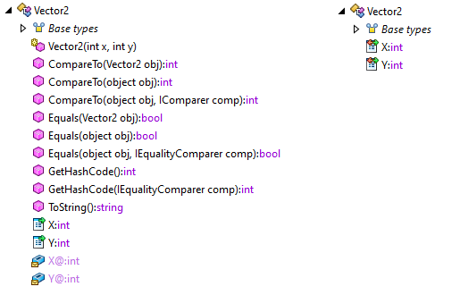

# If you use .NET, build your objects in F#

So towards the end of October, I [tweeted][1] (as one does) about building
domain objects and models in F#. I mentioned a few nice things about it, so
today I intend to do a deeper dive into some of those nice things, and talk
about why they are concerns you should keep in the back of your head when you
make a decision about how to build your domain models.

Now it's [no][2] [secret][3] [that][4] [I][5] [like][6] [F#][7]. I talk about
it a lot (among many other things), largely because when I am doing .NET work,
there is almost always some F# involved. (It might be a small portion, or it
might be a large portion, depends on the project.) As a result, if you've ever
spoke with me in person about programming, I've probably talked about it.

Today, I'm going to show you why F# is a very cool tool in the .NET ecosystem,
and how F# fixes a lot of class-oriented things that, in my opinion, C# does
wrong.

---

## F# does a lot of the heavy-lifting for object-oriented work

One of the most impressive things I feel F# has to offer is the level of
generation it offers for object-oriented work. How it can give you a lot of
things you usually spend a good chunk of time on for free. Three lines of F#
can do something that would take, genuinely, dozens (or even hundreds) of lines
of C#.

If you've ever done OOP work, chances are you've had to write a `.ToString()`,
or a `.Equals(object)`, or a `.GetHashCode()`. Spoiler alert: with F# you don't
need to write any of those most of the time. (You can, but it's ill-advised.)

Let's take a common game-development scenario in C#: vectors. In physics, a
vector is a distance and direction. Start at the origin (or point (0,0)), then
adjust position from there based on the direction given, and the distance, move
to the new location.

Commonly, we represent them in one of two ways:

- r, Θ
- x, y

You are likely familiar with the `(x, y)` format: this is standard point
representation for the cartesian coordinate system. The `(r, Θ)` format is
common in polar coordinate systems.

Long-winded math aside, the two values can be translated between. We'll build a
sizable `Vector2` feature-set into our program, and see how the F# and C# of
the implementation vary.

A standard C# starting point might be something like the following:

    public class Vector2 
    {
        public int X { get; set; }
        public int Y { get; set; }
    }
    
In F#, we would do something like the following:

    type Vector2 = {
        X : int
        Y : int
    }
    
Alright, so far F# hasn't really lived up to the promise. It's the same length
as the C#, and we don't really see any advantages.

Fair. We haven't done anything to really take advantage of F# yet, but one of
the things we _already_ have is an implementation of `.ToString()`,
`.Equals(object)`, and `.GetHashCode()`. It also implements
`IEquatable<Vector2>`, `IStructuralEquatable`, `IComparable<Vector2>`,
`IStructuralComparable`, and `IComparable`.

I could go into a large digression on the intermediate language generated and
how it works, why it's important, etc., instead, I'm going to just use a quick
screenshot of the generated F# class (left) to the generated C# class (right).

Wow are those different. F# implemented 9 additional methods and even setup a
constructor for us. Not so bad. The C# version, on the other hand, is _just_
the two properties. So really, our 4 lines of F# is equivalent to a _lot,
lot more_ in C#. In fact, the F# version is even immutable. Sure, we could omit
the `set` in the C# to achieve the same, but then we have to define our own
constructor. My point with this first example is to demonstrate how effective
F# is at generation. We'll dig deeper into what it means in a few moments.

Now, I could stop here, and I suppose if I were publishing this right now I
might, but today I'm going to go a little further.

---

## Why is all this F# generation important?

This is probably the more important part to discuss: why is the generation F#
provides so important? Why do I push it as such a major reason to build objects
in F#?

It all boils down to a couple basic points:

1. Structural equality and comparison is important for doing effective matching
and evaluation of objects against one-another.
2. These few functions are extremely important if the object itself is to be
used in a `HashMap` scenario. (I.e. a dictionary key, etc.)

Basically, it boils down to performance and developer ease. A lot of times we
want to be able to do something like `if a = b then ...`, but we find out that
there is no `=` operator between `a` and `b`, even when `a` and `b` are the
same type. So you go ahead and define your own operator, just to need to define
a `.Equals(object)` method and then `.GetHashCode()`. You will also want both
of these implemented if you are using LINQ, as some of the LINQ methods / query
syntax require them.

Unfortunately, in C# we don't get those features. Instead we only have a base
implementation (the default) for both `Equals(object)` and `GetHashCode()`. The
base implementations don't do structural equality at all, so two objects that
are exactly the same might not match via `.Equals(object)`. (Spoiler: unless
they are the exact same instance, they _won't_ match via the default.)

This also comes in to heavy play with `struct` types, as it's expected that two
structures (which are expected to be value types) that are instanced via the
same values would be the same. But alas, by default, they are not such in .NET.

So, let's look at some situations we would have to write a _lot_ of manual code
for in C#, that F# just gives us.

### Scenario 1: you want to determine if an element is in an array.

Let's assume you have an array of `elements`, and you want to determine if you
have a certain element in the array. With the new LINQ syntax in C#, it should
be rather simple, no?

    var find = new Vector2() { X = 1, Y = 2 };
    var results = elements.Where(x => x.Equals(find));
    
Seems reasonable, should work fine. Except it wont. The problem here is that we
don't override `.Equals(object)`, and we don't have a `.Equals(Vector2)`, so
our default C# version won't work. Our F# version will work fine though, as we
have both of those options in the F# version. One note: for the F# version we
must initialize `find` via the constructor, because it's immutable (which lends
well to a later point).

To get the C# version to work, we really just need to pick one of the two to
implement, though for fairness we'll actually implement both.

    public override bool Equals(object other) => Equals(other as Vector2);
    public bool Equals(Vector2 other) => other != null && X == other.X && Y == other.Y;    

So we added two lines (at a minimum) to our C# to make sure this works, but we
end up with working code, so we are done here.

First note: your IDE might state that you didn't override `GetHashCode()`, and
it's entirely correct! It's always a best practice to override both if you are
doing one of them. Second note: you might find that the two lines printed by 
the C# version are different than the F# version, and they are. The F# version
has a custom `.ToString()` implementation, which means when we do a print line
for it, we get a nicer string.

### Scenario 2: you have two collections, and you want to create the collection of the elements present in both.

This scenario is your basic `Intersect` scenario: you have some `elements1` in one
collection, and some more `elements2` in another collection. You want to create
a single collection that encompasses only those elements that are present in
both collection.

You might write some code like the following:

    var results = elementsA.Intersect(elementsB).ToArray();
    Console.WriteLine(results.Length);
    
In the C# version, you'll find that no elements match no matter how you call
the `Intersect` function, and that the F# version gives you some.

Again, we're missing a key piece, I alluded to it earlier: `GetHashCode()`. We
_need_ it for `Intersect` to work properly.

So, we'll create a poor implementation:

    public override int GetHashCode() => X ^ Y;
    
Now the C# version works fine.

Note here: the F# `GetHashCode()` is a _good_ implementation, ours was a poor
attempt to make sure that we got _something_ in place for .NET to use. In .NET,
it's OK for two different elements to return the same code, because
`Equals(object)` is the final decision maker, but two identical elements may
NOT return different hash codes.

---

At this point, I wanted to go into some performance implications of the C#
classes vs. the F# generated objects, but because this post is already long,
and also because it's Christmas, I'm going to save that discussion for a later
date. In fact, I'm going to target mid-January for that discussion. That said,
I recommend doing some tests of the C# vs. F# objects, and especially in usage
as dictionary keys. You might find some interesting results.

Additionally, this is all up [on GitHub][8], so feel free to play with the
exact code I was using to test our setups.

[1]: https://twitter.com/EBrown8534/status/1189615987949215746
[2]: https://twitter.com/EBrown8534/status/1136671940079509504
[3]: https://twitter.com/EBrown8534/status/1195001538692997120
[4]: https://twitter.com/EBrown8534/status/1140716675937046528
[5]: https://twitter.com/EBrown8534/status/1209207151501164545
[6]: https://twitter.com/EBrown8534/status/1131290353137594368
[7]: https://twitter.com/EBrown8534/status/1174087565168787456
[8]: https://github.com/EBrown8534/FS-Advent-2019
